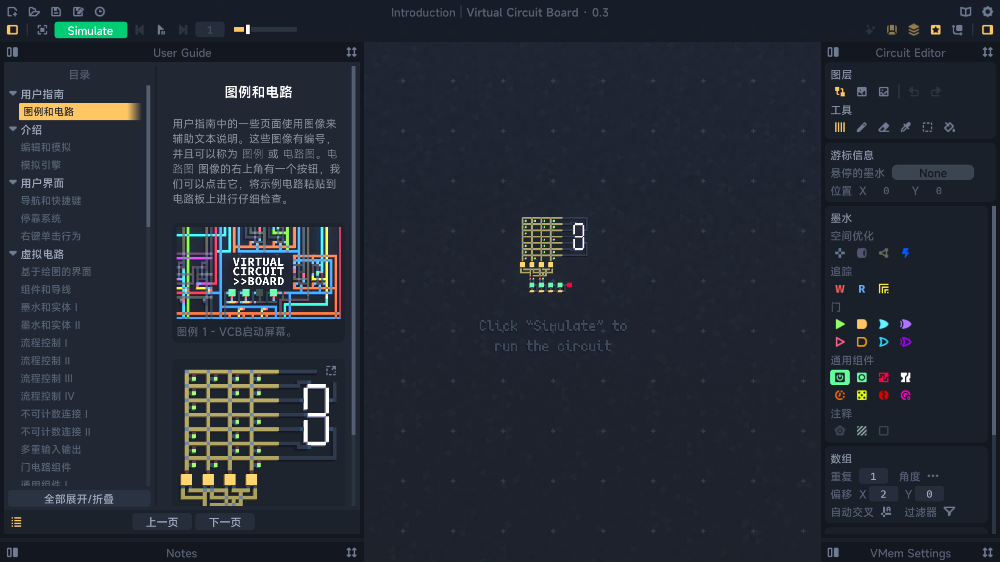
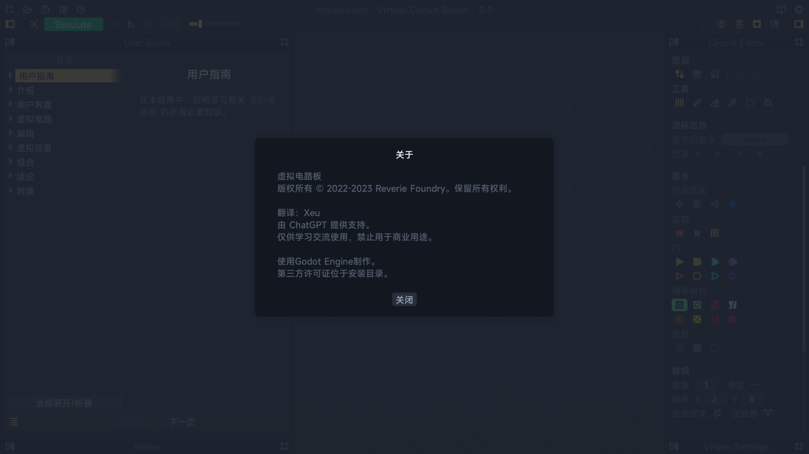
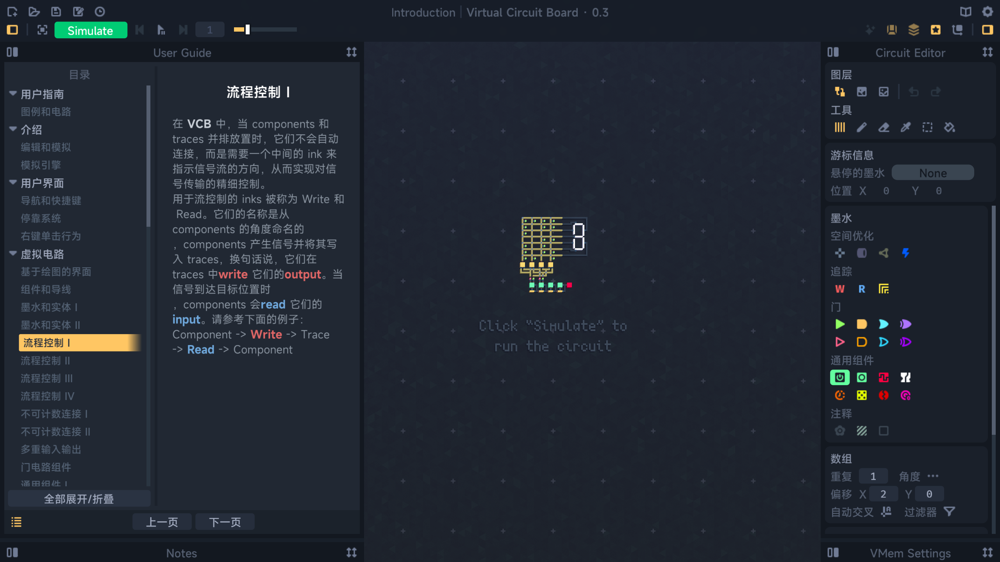

# Virtual Circuit Board 虚拟面包板汉化包
翻译：Xeu  
由 ChatGPT 提供翻译支持。  
所有汉化内容对照表请参阅 mapping 文件夹，vcb.json 为原文， vcb_cn.json 为 ChatGPT 翻译后内容  
仅供学习交流使用，禁止用于商业用途。  
# 效果图

# 使用方法

1. 退出 vcb
2. 进入 [Release](https://github.com/ThankRain/vcb_cn/releases) 下载对应 vcb 版本的 pck 文件
3. Steam 库中右键点击 vcb，选择 管理 -> 浏览本地文件打开应用目录
4. 打开应用目录将 vcb.pck 文件替换为下载的 vcb.pck
5. 下次启动 vcb 即可生效

# 文件大小说明
由于内置的字体不支持其他语言，故塞入了全套的 **MiSans** 字体，导致资源包大小由原先的 5.40 MB 增加至 50.2 MB，增加了 45 MB

# 更新日志
## 23.08.04
- 修复大量机翻错误
- 更新 v0.3(2023.05.20) 版本汉化包
